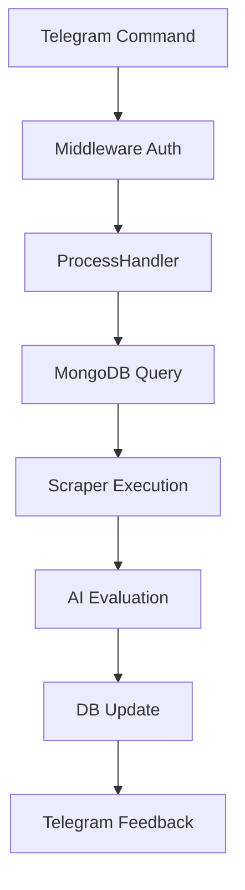

# Telegram Bot Technical Specification

## 1. Bot Architecture & Framework Stack

### **Library/Framework:**
- Utiliza `python-telegram-bot` (v13+) basado en la clase `ApplicationBuilder` importada en `app/bots/telegram/app.py`
- Extiende funcionalidad con `telegram.ext` para routers (`CommandHandler`), filters y middleware

### **Directory Structure & Responsibilities:**
```text
app/bots/telegram/
├── __init__.py              # Módulo de inicialización
├── app.py                   # Configuración principal del bot, ciclo de vida e integración con MongoDB
├── circuit_breaker.py       # Mecanismo de gestión de fallos críticos con circuito de protección
├── handlers.py              # Funcionalidades de manejo de comandos y mensajes
└── messages.py              # Helpers para mensajes estructurados y formateo
```

## 2. Configuration & Environment Variables (`.env`)

| Variable Name              | Usage & Behavior                                                                 |
|--------------------------|----------------------------------------------------------------------------------|
| `TELEGRAM_BOT_TOKEN`     | Token de autenticación principal para inicializar `ApplicationBuilder`. Obligatorio |
| `MY_TELEGRAM_ID`         | ID numérica del único administrador autorizado a ejecutar comandos críticos         |
| `DELAY_BEFORE_EVALUATION`| Segundos de espera antes de procesar proyectos pendientes (predeterminado 30s)       |
| `DELAY_BETWEEN_BATCHES`  | Segundos de espera entre lotes de procesamiento de proyectos (predeterminado 4s)     |
| `STATE_FILE_PATH`        | Ruta al archivo `state.json` necesario para el scraper de Workana                   |

## 3. Lifecycle Management & Operational Mode

### **Inicialización:**
1. Carga `ApplicationBuilder().token(...)` desde `.env`
2. Configura `connect_timeout=30s` y `read_timeout=30s`
3. Establece `post_init=post_init_wrapper` que:
   - Registra comandos personalizados en el menú azul de Telegram
   - Inicializa conexión a MongoDB a través de `connect_to_mongo`
4. Establece `post_shutdown=close_mongo_connection`

### **Modo de Operación:**
- **Long Polling** por defecto (no se detectan configuraciones de webhook en el código actual)
- Manejo de eventos mediante bucle `asyncio` del framework
- Sistema de semafóro global implementado en `circuit_breaker.py` para evitar procesamiento concurrente de proyectos

## 4. Routing, Commands & Middleware Strategy

### **Mecanismo de Enrutamiento:**
```python
ApplicationBuilder()
    .add_handler(CommandHandler("start", start))
    .add_handler(CommandHandler("status", status))
    .add_handler(CommandHandler("lista", fetch_projects))
    .add_handler(CommandHandler("procesar", process_projects))
    .add_handler(CommandHandler("desbloquear", unlock_semaphore))
    .add_handler(MessageHandler(filters.TEXT & (~filters.COMMAND), start))
```

### **Middlewares Implementados:**
- **Autenticación Admin:** Middleware `is_admin()` en `handlers.py` que verifica `MY_TELEGRAM_ID`
- **State Management:** Uso de semáforos en `process_projects()` para:
  - Bloquear ejecuciones concurrentes
  - Telemetría de progreso (`processed_count`, `failed_count`)
  - Manejo de tiempo de inactividad
- **Error Categorización:** Jerarquía de excepciones personalizadas incluyendo:
  `CircuitBreakerWarning`, `CircuitBreakerSuspension`, `CircuitBreakerCritical`, `AIConnectionError`

## 5. Integration with Application Core

### **Flujo de Integración:**
1. **Scraper Workana:**
   - Invoca `ScraperFactory.get_scraper()` para extracción de proyectos
   - Valida existencia del `state.json` para sesión persistente

2. **Base de Datos MongoDB:**
   - Uso de `get_projects_repository()` para:
     - Sincronizar proyectos recientes
     - Marcar estado de procesamiento (`pending`, `analyzed`, `not_found`)

3. **Intelecto Artificial:**
   - `create_intelligence_service()` inyecta adaptadores:
     - `FILTER`: Evaluación rápida de relevancia
     - `STANDARD`: Formateo de descripciones de proyectos
     - `PREMIUM`: Generación de propuestas complejas
   - Integración temprana de circuit breaker para errores de la IA

4. **Telemetría del Proceso:**
   - Actualiza estado del semáforo en tiempo real
   - Notificaciones progresivas de progreso mediante Telegram

5. **Mensajes Estructurados:**
   - Uso de `send_long_message()` en `messages.py` para mensajes largos
   - Formateo con Markdown y enlaces interactivos

