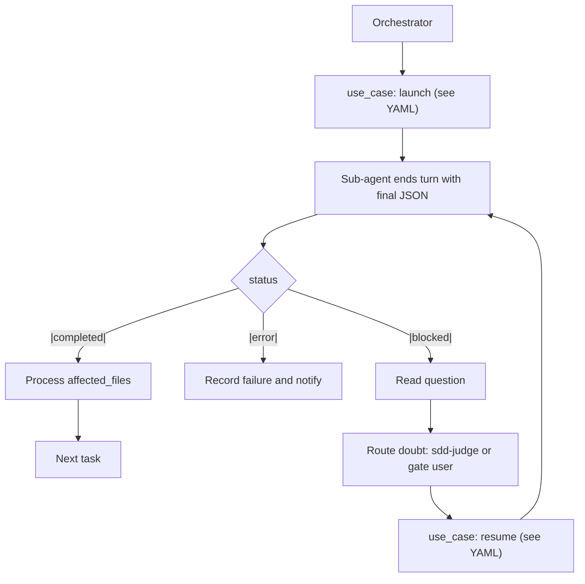

# SDD Protocol — SUBAGENT_COMMS (Sub-Agent Communication & Lifecycle)

Defines how the **Orchestrator** and **Sub-Agents (Workers)** exchange results and control the task lifecycle under the sub-agent surface defined in `.sdd/sub-agents/pi/nicobailon-pi-subagents.yaml`. This is the **single source of truth** for result format and blocked/resume semantics. Worker and orchestrator protocols reference this file instead of duplicating the contract.

---

## 1. Sub-Agent Result Contract

### 1.1 Rule

Every sub-agent MUST end its turn by emitting a **single JSON object** as its final
result, with no additional text before or after it. The orchestrator reads it via
`use_case: read_result` (see `.sdd/sub-agents/pi/nicobailon-pi-subagents.yaml`), extracts
that JSON from the final message/structured output and validates it against the canonical
schema (see §1.2 y §1.5).

**Canonical structured close.** When launched with an `outputSchema` matching the
canonical `report_status` (defined globally in `.sdd/sub-agents/sub-agents-surface.yaml`
→ `report_status.output_schema`, consumed by
the harness port), the harness exposes the internal `structured_output` tool and REQUIRES the
worker to call it as its final action — prose/completion without calling that tool fails the
step. This is the guaranteed path to receiving the canonical JSON without prose or a fenced
`acceptance-report`. Omitting `outputSchema` degrades to legacy JSON-in-text (§1.5). The schema
of the emitted JSON is, in all cases, the one in §1.2.

### 1.2 Canonical JSON

```json
{
  "status": "completed" | "blocked" | "error",
  "success": true | false,
  "summary": "concise summary of the work done, or the reason for the block",
  "affected_files": ["path/a/file1.ext"],
  "error_details": null | "technical detail of the error if status is 'error'",
  "question": null | "specific question for the orchestrator if status is 'blocked'"
}
```

**Schema source:** this canonical object (and its formal JSON schema) is the one defined in
`.sdd/sub-agents/sub-agents-surface.yaml` → `report_status.output_schema`. Its contract
semantics (what `status`/`success`/`error_details` mean, when each field is `null`) is
documented in that file (`semantics` section). At runtime the JSON validates against that
schema (structure) and is interpreted according to that semantics.


**Reviewer extension (sdd-reviewer role):** When used by the `sdd-reviewer` role,
the canonical JSON schema is extended as follows:

- The singular `"verdict"` field (as referenced in earlier reviewer protocols)
  is **replaced by a `"verdicts"` array**.
- Each element in the `verdicts` array is an object with:
    - `"ack_id"`: string identifying the ACK (e.g., `"criterion-1"`)
    - `"status"`: `"approved"` | `"rejected"` | `"blocked"`
    - `"evidence"`: string summarising the reviewer's finding

This extension applies **only** to the `sdd-reviewer` role. All other sub-agents
use the core schema above without `verdicts`.

```json
{
  "status": "completed" | "blocked" | "error",
  "success": true | false,
  "summary": "concise summary of the work done, or the reason for the block",
  "affected_files": ["path/a/file1.ext"],
  "error_details": null | "technical detail of the error if status is 'error'",
  "question": null | "specific question for the orchestrator if status is 'blocked'",
  "verdicts": [
    {
      "ack_id": "criterion-1",
      "status": "approved",
      "evidence": "The implementation satisfies the criterion."
    }
  ]
}
```

### 1.3 Status rules

| status | Meaning | Required fields |
| :--- | :--- | :--- |
| `"completed"` | The task was completed in full. | `question` and `error_details` must be `null`; `success` = `true`. |
| `"blocked"` | Missing information, specification, credential, or design decision. | Put the exact doubt in `question`; `success` = `false`. The sub-agent pauses work (its progress is saved on disk / in the files). |
| `"error"` | Unrecoverable failure (e.g. unsolvable compilation error, broken dependency). | Explain in `error_details`; `success` = `false`. |

### 1.4 Naming rule: `affected_files`

The file field is **`affected_files`** (not `changed_files`) because it unifies both cases:
- editing sub-agents (`sdd-worker`, `sdd-ui-worker`, `sdd-doc-updater`, `test-writer`) → files **created/modified**.
- `test-runner` → files **affected** by failures in its run (its specific `failing_test_files` output is defined in its own protocol `test-workers/TEST_RUNNER.md`).

### 1.5 Final-message robustness (emitter + receiver contract)

The contract has two complementary layers, which were **validated with the models in `.sdd/models.yaml`** (PoC: cycle `blocked` → `resume` → `completed`, with a per-model context secret, on `nemotron-3-ultra-550b-a55b:free`, `nemotron-3.5-lightning:free`, `nemotron-3-super-120b-a12b:free`, `gemini-2.5-pro`, `poolside/laguna-s-2.1` and `deepseek-v4-flash-0731`):

- **(A) Emitter prescription (directive).** The sub-agent ends its turn by emitting the **single canonical JSON** as its last message (§ 1.1). When the instruction is explicit and directive ("end your turn with a single JSON, nothing else"), every model in `.sdd/models.yaml` complies; the directive wording also prevents models with a tendency to "gather context first" (observed on `poolside/laguna-s-2.1` with an ambiguous prompt) from drifting into prose.
- **(B) Receiver tolerance (safety net).** The orchestrator **extracts** the JSON from the final message instead of assuming the whole body is pure JSON. Even compliant models may prepend a stray line to the JSON (observed in the PoC: `POC_SECRET = manzana-verde-77` before the JSON on `deepseek-v4-flash-0731`). Recommended parsing: locate the `{`…`}` block of the final message and validate it against the canonical schema (§ 1.2), ignoring the surrounding text. Do not blind-`JSON.parse` the whole message.

With (A)+(B), a model deviation degrades in a controlled way: recovery is possible as long as the canonical JSON is present in the final message.

---

## 2. Orchestrator Workflow (lifecycle loop)

       [Orchestrator]
             │
             ▼
    1. Invoke Sub-agent ──► use_case: launch (see YAML)
             │
             ▼
    2. Receive final JSON ◄── Sub-agent ends its turn
             │
             ├──► status == "completed"?
             │          └─► [SUCCESS] Process 'affected_files', update the spec and move to the next task.
             │
             ├──► status == "error"?
             │          └─► [ERROR] Record the failure, notify the developer or run a fallback strategy.
             │
             └──► status == "blocked"?
                        ├─► Read 'question' from the JSON
                        ├─► Route the doubt: MODE_AUTO → sdd-judge arbitration (see DEVELOP.md J-1..J-5);
                        │   else → gate the user (fail-closed). The orchestrator does NOT resolve it.
                        └─► Resume the sub-agent with use_case: resume (step 3)
                        └─► (the cycle repeats from step 2)

### 2.1 Decision tree



---

## 3. Resume flow (blocked / paused)

`use_case: resume` is used to continue a sub-agent **without restarting its task**,
preserving all its previous context/session (what it read/edited before stopping). It applies to two
states:

- **`status: "blocked"`** — the sub-agent ended its turn with a doubt in `question`.
   To continue the SAME sub-agent and recover its context, use `use_case: resume`.
- **`paused` (after `interrupt`)** — the orchestrator paused the sub-agent manually
   (e.g. to allow a commit in the middle of the work, or to revive a
   sleeping sub-agent with accumulated context). `use_case: resume` revives it at the same
   point, returning a **new run id** (the session is preserved even though the id changes).

Via `use_case: resume` (see `.sdd/sub-agents/pi/nicobailon-pi-subagents.yaml`):
  resume: "<PAUSED_OR_BLOCKED_SUBAGENT_ID>"
  task: "<fresh instruction/direction to continue>"

- The sub-agent recovers its previous context, continues, and re-emits a final JSON
  (the cycle repeats from § 2).
- The initial `ID` was returned by the `use_case: launch` call (with `async: true`). After a `resume`,
  the run returns a new id that is used for subsequent `read_result`/`steer`.
  The sub-agent's session/conversation is preserved.
---

## 4. steer (running only)

`use_case: steer` (see `.sdd/sub-agents/pi/nicobailon-pi-subagents.yaml`) is used
ONLY to redirect a sub-agent **while running**. It does NOT apply to the
`blocked` case (turn ended) — for that use `use_case: resume`.

---

## 5. Tool Quick Reference

| Action | KEY (see `.sdd/sub-agents/pi/nicobailon-pi-subagents.yaml`) |
| :--- | :--- |
| Launch sub-agent | `use_case: launch` |
| Read final result | `use_case: read_result` |
| Redirect while running | `use_case: steer` |
| Resume a `blocked`/`paused` (keeps session) | `use_case: resume` |
| Wait async | `use_case: wait_result` |

`use_case: launch` carries the canonical structured-output path: `launch` adds an
`outputSchema` = `report_status.output_schema` (from `.sdd/sub-agents/
sub-agents-surface.yaml`) plus `acceptance: { report: "on" }`, which routes each sub-agent
result through the `structured_output` tool (§1.1). `read_result` reads that captured value.

---

## 6. Referenced by

- Workers: `dev-workers/DEV-WORKER.md`, `dev-workers/DEV-UI-WORKER.md`, `dev-workers/DEV-JUDGE.md`, `test-workers/TEST_WORKER.md`, `test-workers/TEST_RUNNER.md`.
- Orchestrators: `orchestrator/DEVELOP.md`, `orchestrator/DOCS.md`, `orchestrator/develop/DEV-CODER.md`, `orchestrator/develop/TESTING.md`, `orchestrator/develop/testing/FIX.md`, `orchestrator/develop/testing/LOOP.md`, `orchestrator/develop/testing/RUN.md`, `orchestrator/docs/SPEC_UPDATE.md`.
- Templates: `templates/source/.pi/extensions/agents/*.md` and the mirror `templates/source/.sdd/protocols/agents/SUBAGENT_COMMS.md`.