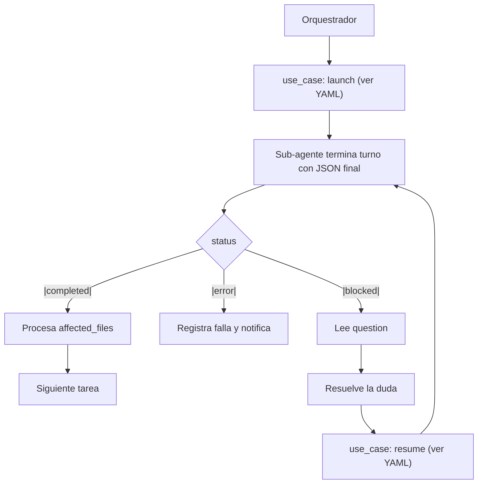

# SDD Protocol — SUBAGENT_COMMS (Sub-Agent Communication & Lifecycle)

Defines how the **Orchestrator** and **Sub-Agents (Workers)** exchange results and control the task lifecycle under the sub-agent surface defined in `.sdd/sub-agents/pi/nicobailon-pi-subagents.yaml`. This is the **single source of truth** for result format and blocked/resume semantics. Worker and orchestrator protocols reference this file instead of duplicating the contract.

---

## 1. Sub-Agent Result Contract

### 1.1 Rule

Every sub-agent MUST end its turn by emitting a **single JSON object** as its final response, with **no additional text before or after it**. The orchestrator reads it via `use_case: read_result` (see
`.sdd/sub-agents/pi/nicobailon-pi-subagents.yaml`), extracts that JSON from the final message and validates it against the canonical schema (see § 1.5).

Communication with the orchestrator happens automatically: the extension captures the sub-agent's final message, so the sub-agent needs **no special call or flag** at the end — it only emits the canonical JSON below and the orchestrator reads it via `use_case: read_result`.

### 1.2 Canonical JSON

```json
{
  "status": "completed" | "blocked" | "error",
  "success": true | false,
  "summary": "resumen conciso del trabajo realizado o de la razón del bloqueo",
  "affected_files": ["path/a/archivo1.ext"],
  "error_details": null | "detalle técnico del error si status es 'error'",
  "question": null | "pregunta puntual para el orquestador si status es 'blocked'"
}
```

**Reviewer extension (sdd-reviewer role):** When used by the `sdd-reviewer` role,
the canonical JSON schema is extended as follows:

- The singular `"verdict"` field (as referenced in earlier reviewer protocols)
  is **replaced by a `"verdicts"` array**.
- Each element in the `verdicts` array is an object with:
    - `"ack_id"`: string identifying the ACK (e.g., `"ACK001"`)
    - `"verdict"`: `"APPROVED"` | `"REQUIRES_CORRECTION"`
    - `"error_details"`: reasons string — **only** when the verdict is `REQUIRES_CORRECTION`
    - `"rejected_followup"`: boolean (`false` by default); `true` for non-fixable failures (e.g. environment blocker, spec gap, architectural decision needing input)

This extension applies **only** to the `sdd-reviewer` role. All other sub-agents
use the core schema above without `verdicts`.

{
  "status": "completed" | "blocked" | "error",
  "success": true | false,
  "summary": "resumen conciso del trabajo realizado o de la razón del bloqueo",
  "affected_files": [],
  "error_details": null | "detalle técnico del error si status es 'error'",
  "question": null | "pregunta puntual para el orquestador si status es 'blocked'",
  "verdicts": [
    {
      "ack_id": "ACK001",
      "verdict": "APPROVED",
      "error_details": null,
      "rejected_followup": false
    },
    {
      "ack_id": "ACK002",
      "verdict": "REQUIRES_CORRECTION",
      "error_details": "the border-radius on the button is 8 but the spec requires 12",
      "rejected_followup": false
    }
  ]
}
```

### 1.3 Status rules

| status | Significado | Campos requeridos |
| :--- | :--- | :--- |
| `"completed"` | La tarea se completó íntegramente. | `question` y `error_details` deben ser `null`; `success` = `true`. |
| `"blocked"` | Falta información, especificación, credencial o decisión de diseño. | Pon la duda exacta en `question`; `success` = `false`. El sub-agente pausa el trabajo (su avance queda guardado en disco / en los archivos). |
| `"error"` | Falla irrecuperable (ej. error de compilación insalvable, dependencia rota). | Explicar en `error_details`; `success` = `false`. |

### 1.4 Naming rule: `affected_files`

El campo de archivos es **`affected_files`** (no `changed_files`) porque unifica ambos casos:
- sub-agentes de edición (`sdd-worker`, `sdd-ui-worker`, `sdd-doc-updater`, `test-writer`) → archivos **creados/modificados**.
- `test-runner` → archivos **afectados** por fallos en su ejecución (su salida específica `failing_test_files` queda definida en su propio protocolo `test-workers/TEST_RUNNER.md`).

### 1.5 Robustez del mensaje final (contrato emisor + receptor)

El contrato tiene dos capas complementarias, que quedaron **validadas con los modelos de `.sdd/models.yaml`** (PoC: ciclo `blocked` → `resume` → `completed`, con un secreto de contexto por modelo, en `nemotron-3-ultra-550b-a55b:free`, `nemotron-3.5-lightning:free`, `nemotron-3-super-120b-a12b:free`, `gemini-2.5-pro`, `poolside/laguna-s-2.1` y `deepseek-v4-flash-0731`):

- **(A) Prescripción al emisor (directiva).** El sub-agente termina su turno emitiendo el **único JSON canónico** como último mensaje (§ 1.1). Cuando la instrucción es explícita y directiva («termina tu turno con un único JSON, sin otra cosa»), todos los modelos de `.sdd/models.yaml` la cumplen; el wording directivo además evita que modelos con tendencia a «juntar contexto primero» (observado en `poolside/laguna-s-2.1` con prompt ambiguo) deriven en prosa.
- **(B) Tolerancia del receptor (red de seguridad).** El orquestador **extrae** el JSON del mensaje final en lugar de asumir que el body completo es JSON puro. Incluso modelos cumplidores pueden anteponer una línea suelta al JSON (observado en el PoC: `POC_SECRET = manzana-verde-77` antes del JSON en `deepseek-v4-flash-0731`). Parsing recomendado: localizar el bloque `{`…`}` del mensaje final y validarlo contra el esquema canónico (§ 1.2), ignorando el texto envolvente. No hacer `JSON.parse` ciego del mensaje completo.

Con (A)+(B), una desviación del modelo degrada de forma controlada: la recuperación es posible mientras el JSON canónico esté presente en el mensaje final.

---

## 2. Orchestrator Workflow (lifecycle loop)

       [Orquestador]
             │
             ▼
    1. Invoca Subagente ──► use_case: launch (ver YAML)
             │
             ▼
    2. Recibe JSON final ◄── Subagente termina su turno
             │
             ├──► ¿status == "completed"?
             │          └─► [ÉXITO] Procesa 'affected_files', actualiza la especificación y pasa a la siguiente tarea.
             │
             ├──► ¿status == "error"?
             │          └─► [ERROR] Registra la falla, notifica al desarrollador o ejecuta una estrategia de fallback.
             │
             └──► ¿status == "blocked"?
                        ├─► Lee 'question' del JSON
                        ├─► Resuelve la duda (consulta interna, reglas del proyecto o usuario)
                        └─► Reanuda el sub-agente con use_case: resume (paso 3)
                        └─► (el ciclo se repite desde el paso 2)

### 2.1 Decision tree



---

## 3. Resume flow (blocked / paused)

`use_case: resume` se usa para continuar un sub-agente **sin reiniciar su tarea**,
conservando todo su contexto/sesión previo (lo que leyó/editó antes de parar). Aplica a dos
estados:

- **`status: "blocked"`** — el sub-agente terminó su turno con una duda en `question`.
   Para continuar el MISMO sub-agente y recuperar su contexto, usar `use_case: resume`.
- **`paused` (tras `interrupt`)** — el orquestador pausó al sub-agente manualmente
   (p. ej. para permitir un commit en medio del trabajo, o para reactivar un
   sub-agente dormido con contexto acumulado). `use_case: resume` lo reaviva en el mismo
   punto, devolviendo un **nuevo run id** (la sesión se conserva aunque el id cambie).

Via `use_case: resume` (ver `.sdd/sub-agents/pi/nicobailon-pi-subagents.yaml`):
  resume: "<ID_DEL_SUBAGENTE_PAUSADO_OR_BLOCKED>"
  task: "<instrucción/dirección fresca para continuar>"

- El sub-agente recupera su contexto anterior, continúa, y vuelve a emitir un JSON final
  (el ciclo se repite desde § 2).
- El `ID` inicial lo devolvió la llamada `use_case: launch` (con `async: true`). Tras un `resume`,
  el run devuelve un nuevo id que se usa para `read_result`/`steer` posteriores.
  La sesión/conversación del sub-agente se mantiene.
---

## 4. steer (running only)

`use_case: steer` (ver `.sdd/sub-agents/pi/nicobailon-pi-subagents.yaml`) se usa
SOLO para redirigir a un sub-agente **en plena ejecución**. NO aplica al caso
`blocked` (turno terminado) — para eso usar `use_case: resume`.

---

## 5. Tool Quick Reference

| Acción | KEY (ver `.sdd/sub-agents/pi/nicobailon-pi-subagents.yaml`) |
| :--- | :--- |
| Lanzar sub-agente | `use_case: launch` |
| Leer resultado final | `use_case: read_result` |
| Redirigir en ejecución | `use_case: steer` |
| Reanudar un `blocked`/`paused` (mantiene sesión) | `use_case: resume` |
| Esperar async | `use_case: wait_result` |

---

## 6. Referenced by

- Workers: `dev-workers/DEV-WORKER.md`, `dev-workers/DEV-UI-WORKER.md`, `dev-workers/DEV-JUDGE.md`, `test-workers/TEST_WORKER.md`, `test-workers/TEST_RUNNER.md`.
- Orchestrators: `orchestrator/DEVELOP.md`, `orchestrator/DOCS.md`, `orchestrator/develop/DEV-CODER.md`, `orchestrator/develop/TESTING.md`, `orchestrator/develop/testing/FIX.md`, `orchestrator/develop/testing/LOOP.md`, `orchestrator/develop/testing/RUN.md`, `orchestrator/docs/SPEC_UPDATE.md`.
- Templates: `templates/source/.pi/extensions/agents/*.md` y el espejo `templates/source/.sdd/protocols/agents/SUBAGENT_COMMS.md`.