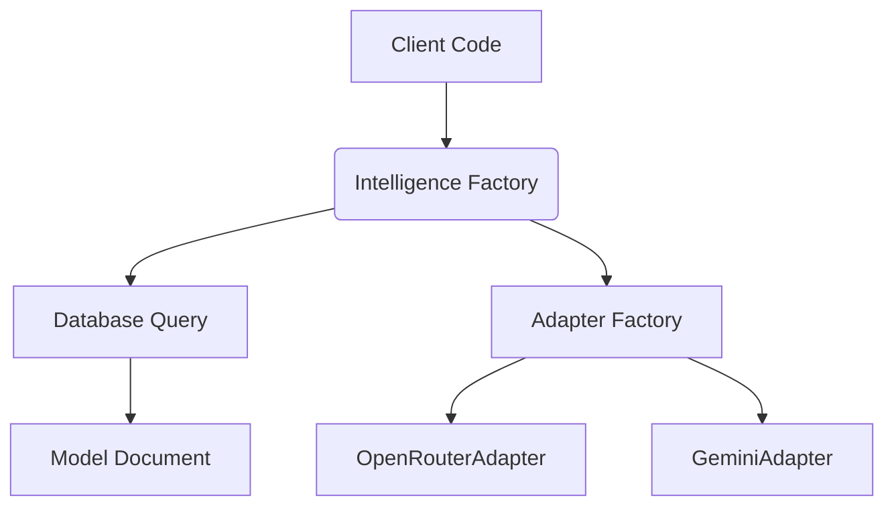

## Architecture Overview

![Dependency Diagram]

```mermaid
graph TD
    A[Client Code] --> B(Intelligence Factory)
    B --> C[Database Query]
    C --> D[Model Document]
    B --> E[Adapter Factory]
    E --> F[OpenRouterAdapter]
    E --> G[GeminiAdapter]
```